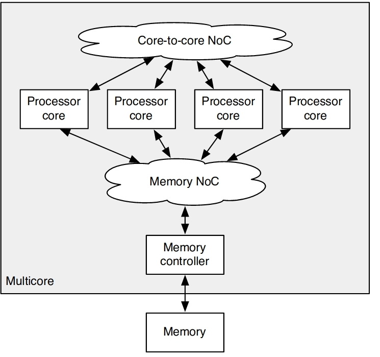

## T-CREST  Memory Network-on-chip

**keywords** WCET (worst case execution time)

1 . T-CREST multi core setup looks like this: 

2 . Two NoCs in T-Crest: 
* 1 . core to core (Patmos cores)
1. message passing between cores
2. most traffic shall stay on-chip
3. torous topology used
4. TDM based arbitration

* 2 .  cores to memory: 
1. read and write (cache line) burst
2. shared memory
3. tree architecture
4. TDM based arbitration

___

**Paper:**

**AIM** : Time predictable memory arbitration and access for CMPs. 

*Keywords:* WCET, RTS, time-predictable compArch, memory arbitration, timing compositional, 

1. To derive safe bounds on **worst-case execution times (WCETs)**, all components of a computer system need to be **time-predictable**: the processor pipeline, the caches, the memory controller,and memory arbitration on a multicore processor.

2. Memory NoC is organized as a **tree** with **TDM** of accesses to the shared memory. 

3. The NoC and the shared memory are shared resources and in general purpose processors they are a source of timing interferences between tasks executing on different processor cores.

4. core to core NoC is used for message passing ; memory NoC is used to connnect all processor cores to the shared external memory via the memory controller. 

5. paper uses **TDM** scheduling from end to end, such that read or write transactions towards the shared memory are transmitted from the initiating processor core to the memory **without any dynamic arbitration or buffering**

6. **Intro:** 
* only processor-local memories buffer any data. 
* transactions are injected according to a global schedule, and thus propogated in a pipelined fashion even **without flowcontrol**
* TDM slots and TDM schedule are defined by the sequence of equally sized read or write transactions towards the memory. 
* this results in a simple hardware implementation and a straightforward WCET analysis. 
* Actually, we are having a global TDM schedule distributed at the processor cores results in a distributed arbitration .. which is good.. as it scales well with increased no. of cores. 
* There is pipeline in the design, and pipleline dealys contribute to the timing analysis. 
* there is no buffering in the NoC and in the memory controller. 

7. **Memory NoC design**: TREE
* A many to one communitcation between several processor cores and a single memory controller. 
* processor core and NI are connected via (OCP = open core protocol) interface, 
* NIs are connected by a tree of merge circuits downstream towards the mem interface (MI) and back upstream for the return data. (See design for clarity)
* What happens at TDM slot? Let's say that a transaction of a core is pending. When its TDM slot comes, the NI acknowledges the transaction to the processor core and the transaction data freely flows down the network tree without any flow control, arbitration, or buffering.
* The memory request arrives at the MI and is translated back to an OCP transaction request, goes to Mem controller. 

8. **Read transaction: **
* broadcast of return data to all cores (can be pipelined) in a broadcast tree manner. 
* What if a processor might see a read return from a former read request by a different processor after sending the read request? 
* two possibilites:? 

9. **Write Transaction: **
* 
8. What does it mean by timing compositional architecture? .. this means that the arch has no timing anomalies or unbounded timing effects. 
