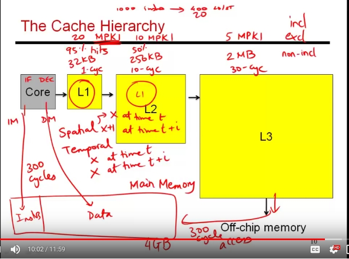

### Cache Hierarchies 

**Keywords**: 
>MPKI - misses per thousand instructions
>inclusive vs non-inclusive/exclusive hierarchy

1.  fetching an instruction from MM or doing load-store withMM will take around 300 cycles for a modern processor. 
  
2. to tackle this: a small portion of this large MM is saved on the chip as cache memory. 

3. caches are implemented as multi-level hierarchy. 

4. usually programs exhibit locality: spatial and temporal locality.

> **temporal locality**: address X accessed at time t, address X accessed at time t+dt. (same location accessed again and again)

>**spatial locality**: address X accessed at time t, address X+1 accessed at time t+dt. (nearby location accessed, tend to sequentially move through data )

 

5. **inclusive**: everything in L1 can also be found in L2.. this means if L1 is of size 32kB, and L2 is of size 256kB.. so: L2 has only 224 kB of space for new data and so, there is a duplication of data. (Though, this makes design of cache coherence protocol easier. )

6. **exclusive:** data found in L1 or L2 but not in both. So, this increases the capacity of cache but makes the cache controller design little more complex. 

7. **non-inclusive hierarchy:** no guranttes that if data is found in L1 it won't be found in L2. Somewhere in between (6) and (7)

Good article at : [Cache inclusion policy](https://en.wikipedia.org/wiki/Cache_inclusion_policy) 

8. many cores can be sitting on processor each with its own private cahce and some shared cache. 

