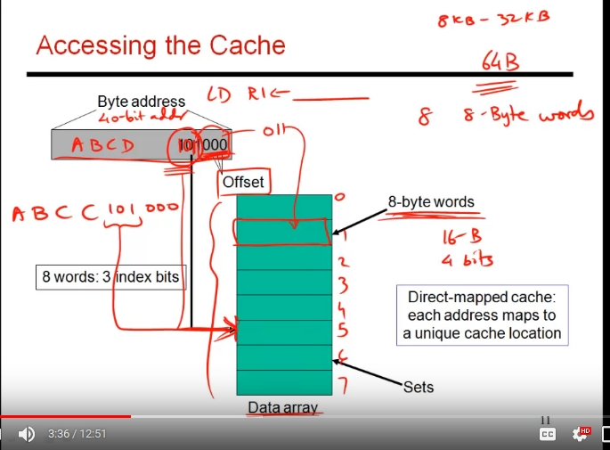
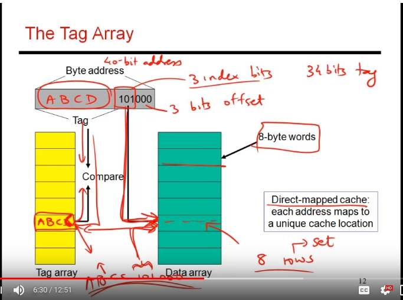
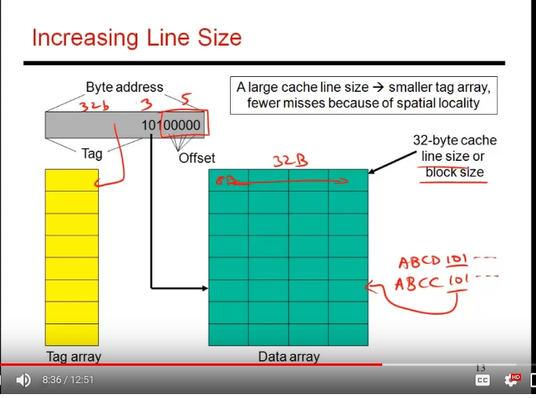
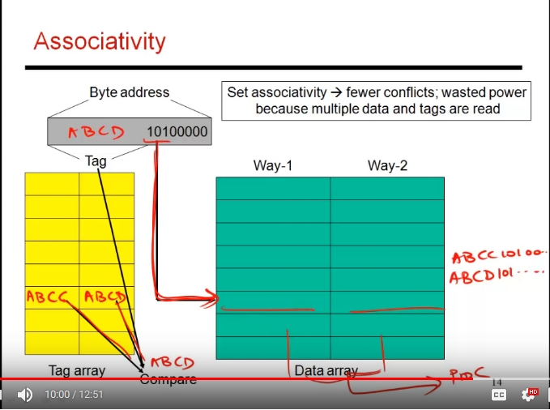
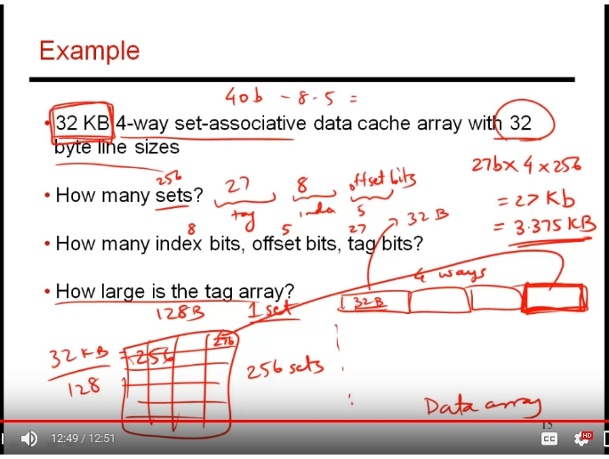

### lec37 : accessing the cache

**keywords:** 

1. organisation of cache : assume the cache contains 64B of data, minimum granularity of keeping a work in one line is 8byte

2. let's say the processor generates a 40-bit address: the last three bits will choose which byte to select from a line(refer to a specific byte), the next three bytes will be index of line in data array

1. the remaining bits in the 40 bit address needs to be compared.. as the lower 6 bits can be common for different combinations of 34 bits. The first 34 bits are called tag bits. they are compared with a tag array. 

2. the arch looks simultaneously at the tag array and the data array at the same index position. 

3. if the tag doesn't match, we bring the data from the MM and fill the data array, update the tag. 
>So address is broken into three different fields: tag -> index -> offset
-> offset of 3 bits as word size is 8byte
-> index of 3bits as data array has 8 lines/sets
-> remaining 4 bits are tag bits. 

4. direct mapped cache: each address is mapped to a unique cache location in the data array. the asked data element can be present at one position only.. .and that's the place where we compare tag. 

1. brining more sequential data into one line: targetting spatial locality.
> set/block/line

2.  for a DM cache: if the program alternates between addresses: ABCD...101_ _ _ _ _  and ABCC...101 _ _ _ _ _ , then there will be cache miss every time. (unusual amount of conflit for the same entry )

1. to solve this: have more blocks for the same set; do two comparisions for the tag. 

1. **Example:) ** : 

> tag array is going to mirror the data array.. in the sense .. there will be similar ways in tag array like data array and these ways of tag will be compared. 
