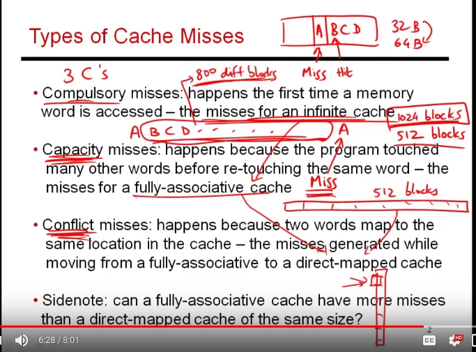
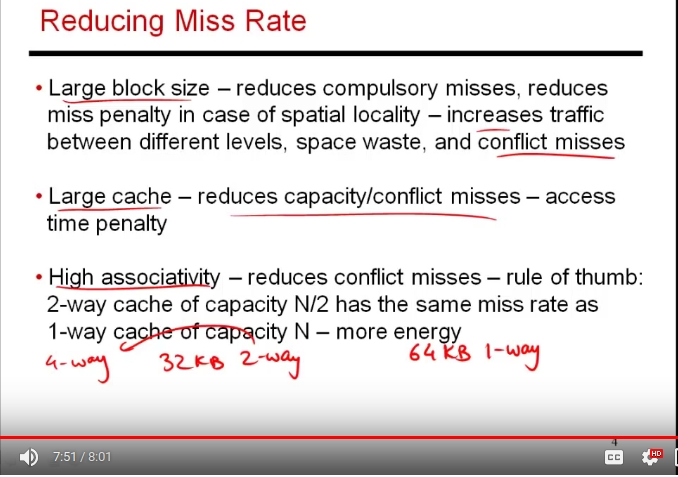

### lec38: basic properties of caches

**keywords: ** lookup of address A, evict(removing a cache line to accomodate some other address)

1. thinking about reducing miss rate and miss penalty! 

2. where there is a miss: i bring an entire block (let's say of size 32B or 64B) .. so this brings the neighbour words too. 
>1. so one way to reduce compulsary miss is to increase the block size.
>2. this way, cpu is doing prefetch of neighbour data elemetns which can lead to fewer misses. 

3. increasing capacity of cache can reduce capacity misses. 
(between reuse of A, we look at how many different blocks I am touching, if that number is higher than number of blocks that can be accomodated,  then its a capacity miss else conflict miss)

