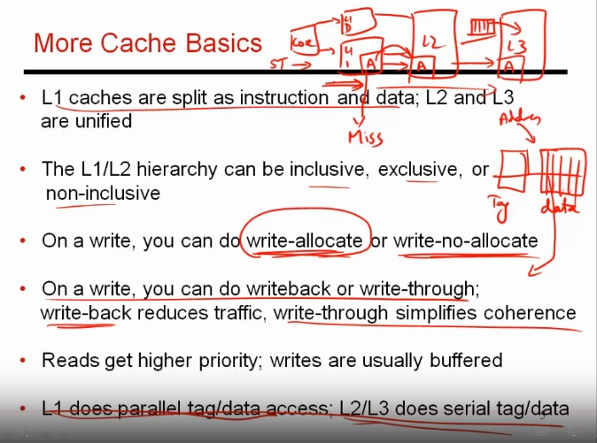

### lec39 - more cache basics

**keywords:** data lookup, write allocate, write-no-allocate, write back, write through, 

___
1.  conider a case: where processor requested address A for store. there happens a miss in L1 and hit in L2. If you bring the block corresponding to address A in L1 it is **write allocate**, and when you don't bring it is **write-no-allocate**
> depending on the data access pattern, we have to choose! 

2. register as scratch pad memory
> some cases where we do store: 
>>1. during a function call, many registers data are stored in stack memory. So, in near future we will retreive the data back.. so temporal locality has not ended. Here write allocate will be needed. 

3. **write-through:** for a inclusive cache, every write propogates through the different levels of heirearchy of caches and MM. This ensures that copies of A are kept consistent. 

4. **write-back:**for a inclusive cache, when i do a write in L1, i don't update the copy of A in L2 or lower levels. So, for some moments the copy of address A will differ at L1 and L2. much later when A gets evicted out of L1, the copy in L2 is updated. 

5. reads get higher priority because cpu is waiting for the data to do computation, but for write.. no instruciton is waiting for the result of write. writes usually gets placed on write buffer. but when the write buffer get's full, the writes get higher priority than reads. 

6. lower level caches are much larger and more set associative than L1.
so for higher level caches, if parallel access is used: then a lot of time and energy is wasted in reading bunch of ways in data array, while comparing the tag and ultimately one of them is going to be useful. Instead, first tag is checked to determine which way has data. Then, that way is read and send back to cpu. 

7. once we get a miss in L1, we are more concerned of getting better hit rate and lower energy consumption. 

